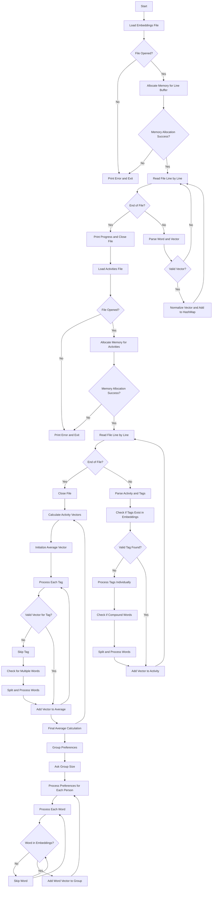

# **Activity Recommender CLI (ARC)**

**Activity Recommender CLI (ARC)** recommends group activities based on **user preferences**. Multiple users input **keywords** representing their interests, which are processed using **word embeddings** to suggest activities matching the group's preferences.

---


---

## **Overview →**

ARC uses **GloVe word embeddings** to analyze group preferences and recommend the most relevant activities. It's a **command-line program built in C**, perfect for quick interactions and lightweight environments.

---

## **How It Works →**



1. **Collect** keywords from each group member
2. **Retrieve** vectors of the user input words from **GloVe embeddings**
3. **Sum and average** to get a **group vector** representing overall preferences
4. **Compare** the group vector with **each activity vector** from the CSV database using **cosine similarity**
5. **Output** the **top 3 matching activities** with the **highest similarity scores**

---

## **Features →**

| **Feature**                    | **Description**                                             |
| ------------------------------ | ----------------------------------------------------------- |
| **Multi-user input**           | Collects preferences from multiple group members            |
| **Word embedding-based logic** | Uses semantic meaning for accurate activity recommendation|

---

## **Setup Guide →**

### **Installation**

```bash
git clone https://github.com/Sabique-Islam/Activity-Recommender-CLI
cd Activity-Recommender-CLI
```

### **Download Embeddings**

* **[Click Here to Download GloVe Embeddings](https://nlp.stanford.edu/data/glove.6B.zip)**
* **Extract** the zip
* Move `glove.6B.300d.txt` into the `data/` directory

### **Build & Run**

```bash
gcc -o arc search.c src/utils.c -lm
./arc
```

---
